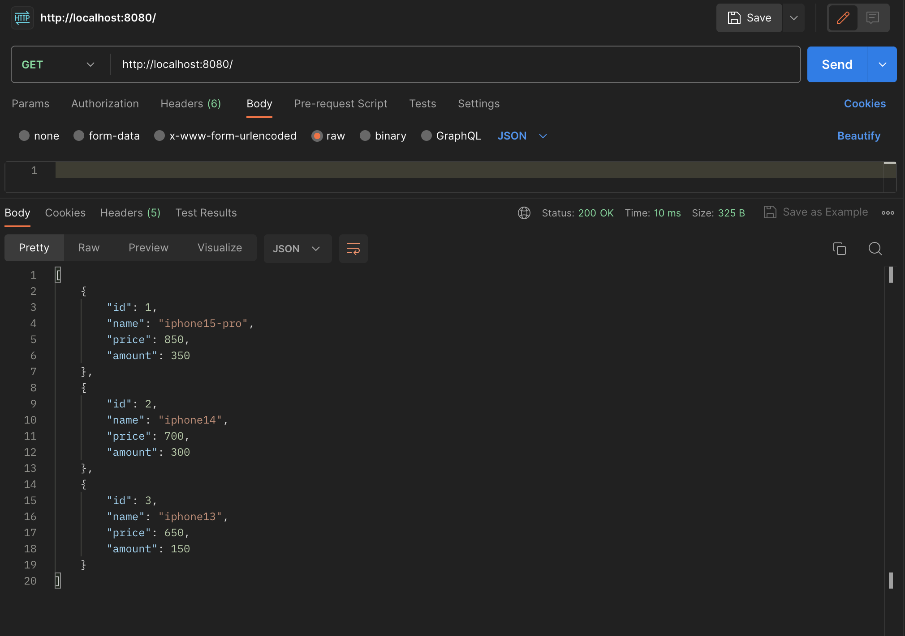
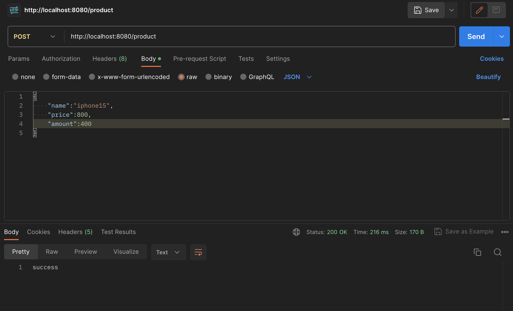
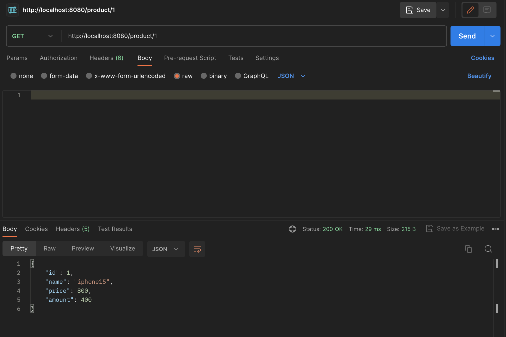
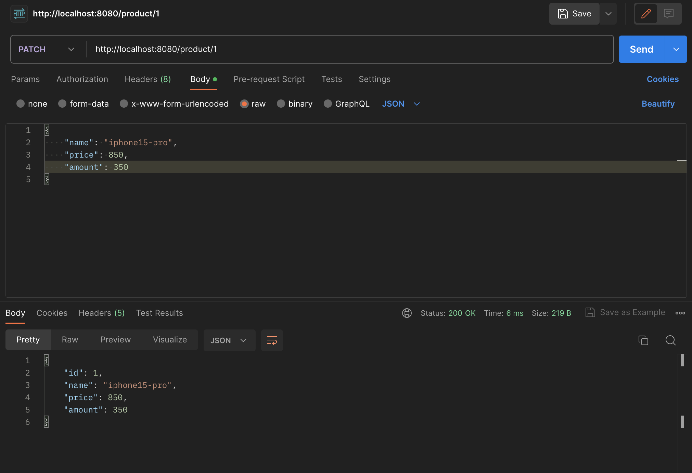
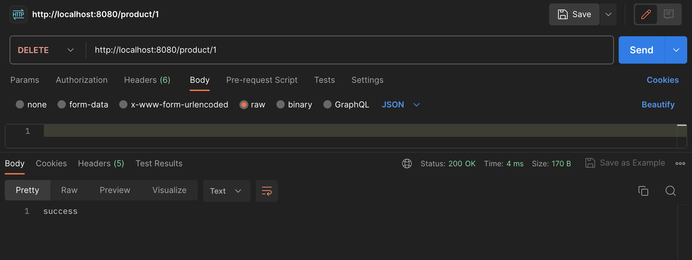
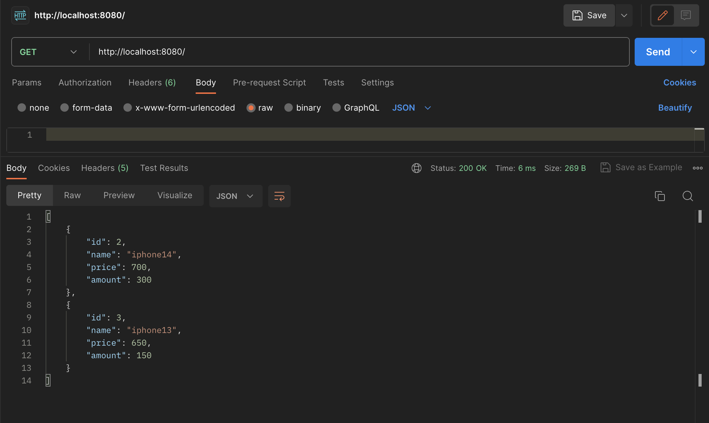
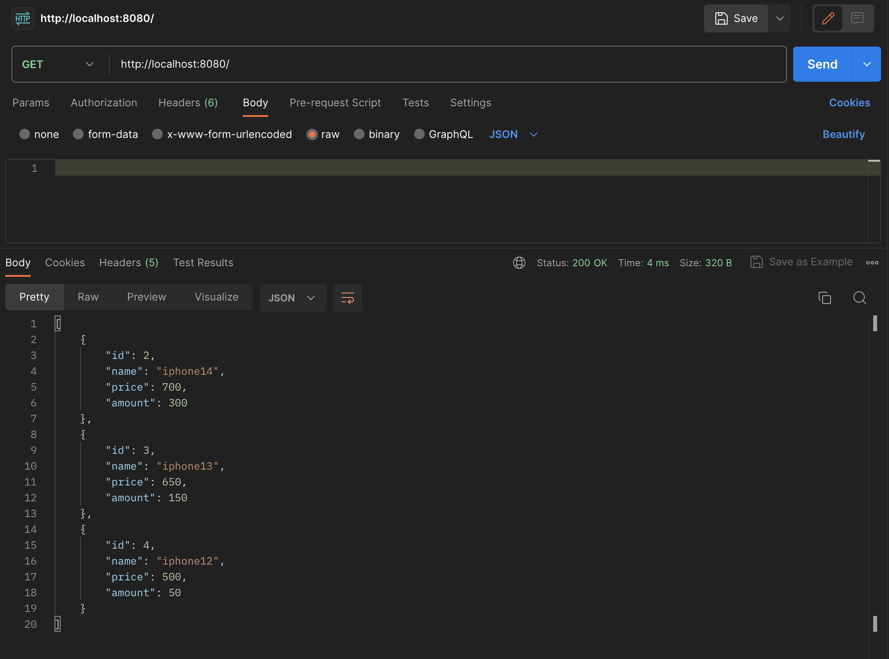

<h3>findALL - http://localhost:8080/

---
<h3>CREATE - http://localhost:8080/product

---
<h3>READ - http://localhost:8080/product/{id}

---
<h3>UPDATE - http://localhost:8080/product/{id}

<h4>id를 바꾸려 해도 바뀌지 않음</h4>

---
<h3>DELETE - http://localhost:8080/product/{id}

  

<h4>삭제 후 모습</h4>

<h4>삭제 후 다른 아이템을 추가한 모습</h4>
