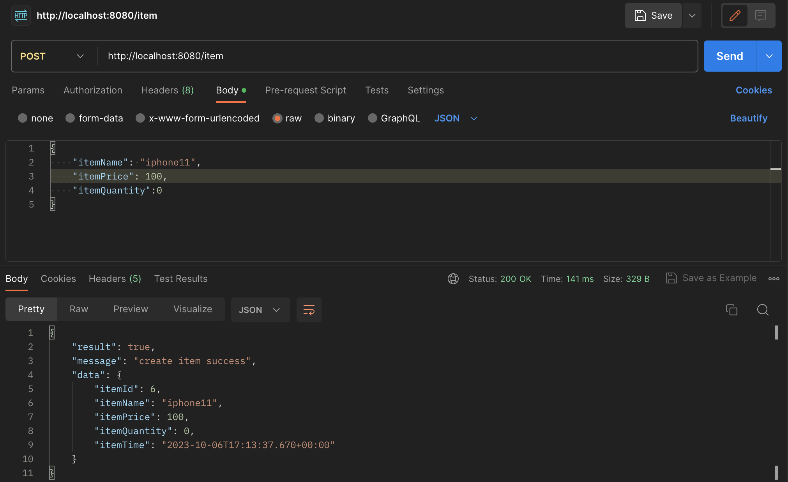
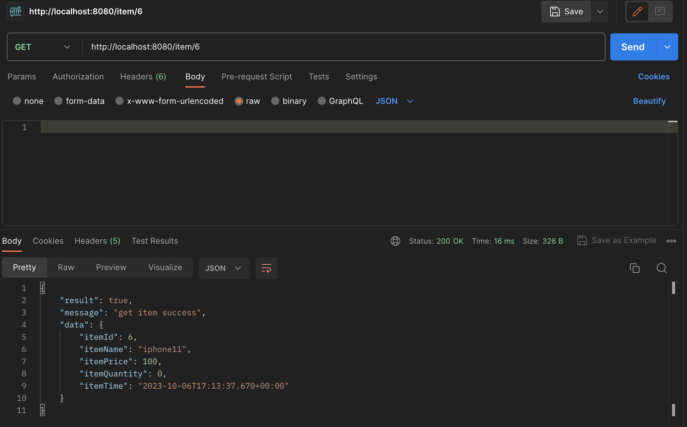
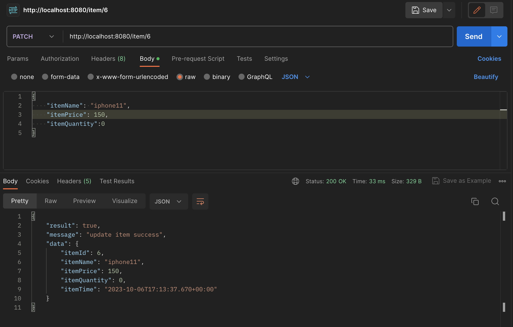
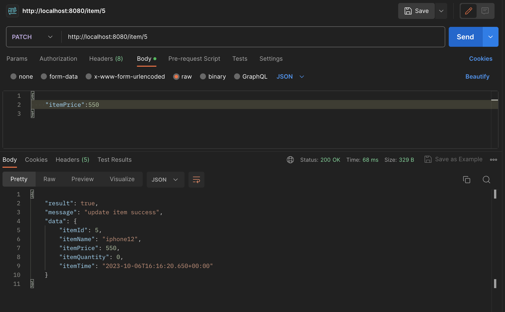
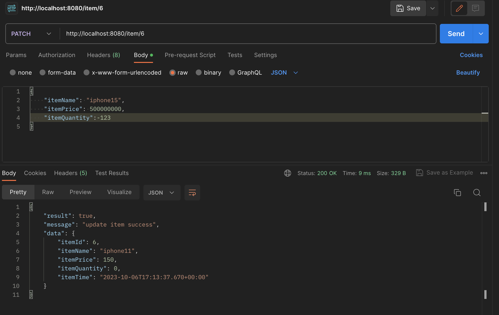
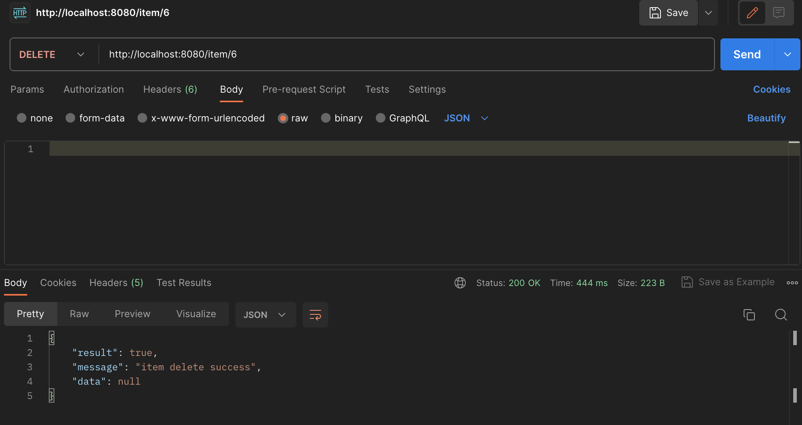
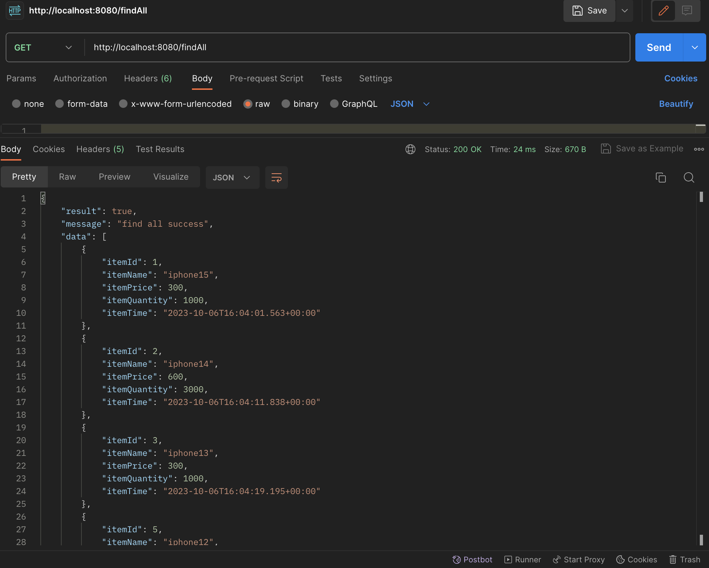
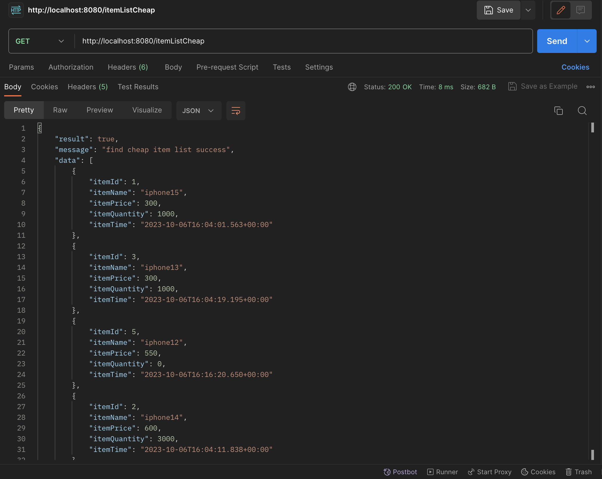
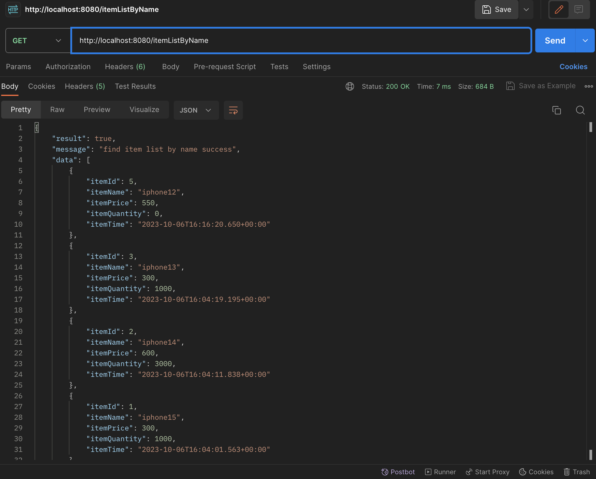
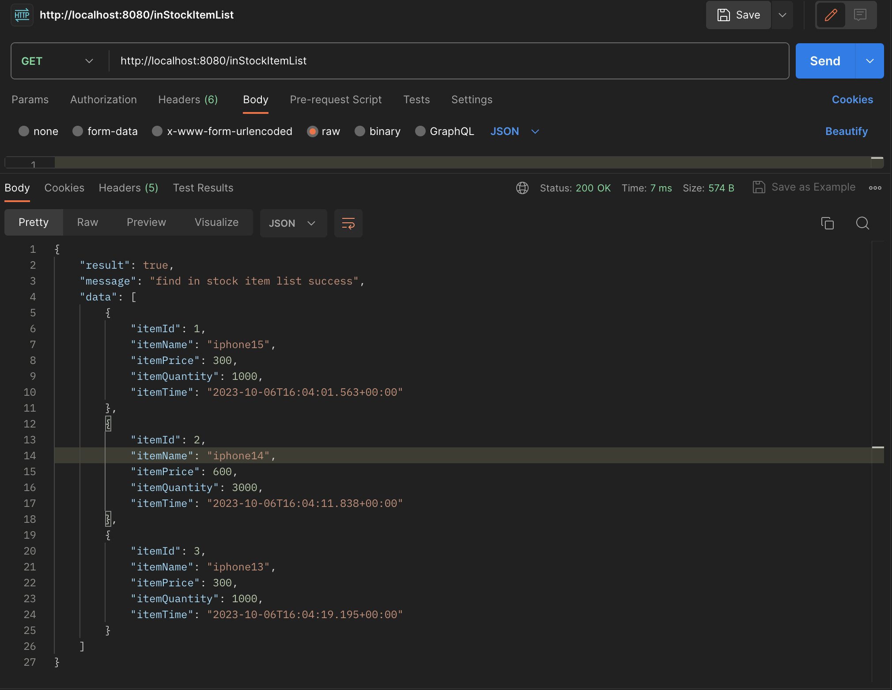

<h2>과제3</h2>

---

<h3>CREATE</h3>
http://localhost:8080/item

아이템 정보를 DB에 저장

---

<h3>READ</h3>
http://localhost:8080/item/{id}

특정 id의 아이템을 받아옴

---

<h3>UPDATE</h3>
http://localhost:8080/item/{id}

특정 id의 아이템의 정보를 수정함

바꿀 정보만 입력하면 그 정보만 바뀜

아이템 이름이 겹치거나, 아이템 가격이 음수거나 50000 이상이거나, 아이템 양이 음수라면 값을 바꾸지 않음

---

<h3>DELETE</h3>
http://localhost:8080/item/{id}

특정 id의 아이템을 삭제함

---

<h3>findAll</h3>
http://localhost:8080/findAll

모든 아이템의 정보를 보여줌

---

<h3>가격 낮은순 정렬</h3>
http://localhost:8080/itemListCheap

모든 아이템을 itemPrice기준으로 오름차순으로 정렬함

---

<h3>이름 순 정렬</h3>
http://localhost:8080/itemListByName

모든 아이템을 itemName기준으로 오름차순으로 정렬함

---

<h3>재고 없는 아이템 제외</h3>
http://localhost:8080/inStockItemList

모든 아이템 중에서 itemQuantity가 0보다 큰 아이템만 보여줌

