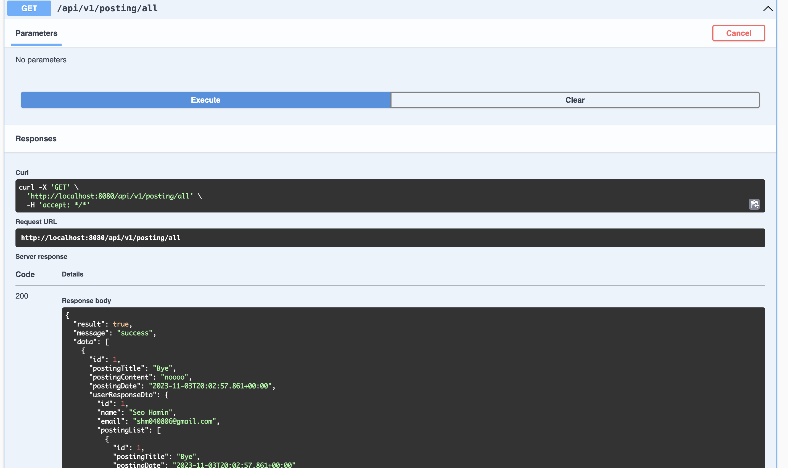

<h1>Homework 4</h1>
유저별 게시물을 쓸 수 있는 블로그

---

<h2>User</h2>
<h3>Create</h3>


<h3>Read</h3>


<h3>Update</h3>


<h3>Delete</h3>


<h3>Read All User</h3>


---

<h2>Posting</h2>
<h3>Create</h3>


<h3>Read</h3>


<h3>Update</h3>


<h3>Delete</h3>


<h3>Read All Posting</h3>


/api/v1/posting/all의 전체 response
```json
{
  "result": true,
  "message": "success",
  "data": [
    {
      "id": 1,
      "postingTitle": "Bye",
      "postingContent": "noooo",
      "postingDate": "2023-11-03T20:02:57.861+00:00",
      "userResponseDto": {
        "id": 1,
        "name": "Seo Hamin",
        "email": "shm040806@gmail.com",
        "postingList": [
          {
            "id": 1,
            "postingTitle": "Bye",
            "postingDate": "2023-11-03T20:02:57.861+00:00"
          },
          {
            "id": 3,
            "postingTitle": "post3",
            "postingDate": "2023-11-03T20:06:12.352+00:00"
          }
        ]
      }
    },
    {
      "id": 3,
      "postingTitle": "post3",
      "postingContent": "post3 content",
      "postingDate": "2023-11-03T20:06:12.352+00:00",
      "userResponseDto": {
        "id": 1,
        "name": "Seo Hamin",
        "email": "shm040806@gmail.com",
        "postingList": [
          {
            "id": 1,
            "postingTitle": "Bye",
            "postingDate": "2023-11-03T20:02:57.861+00:00"
          },
          {
            "id": 3,
            "postingTitle": "post3",
            "postingDate": "2023-11-03T20:06:12.352+00:00"
          }
        ]
      }
    },
    {
      "id": 4,
      "postingTitle": "post4",
      "postingContent": "post4 content",
      "postingDate": "2023-11-03T20:06:48.942+00:00",
      "userResponseDto": {
        "id": 3,
        "name": "user3",
        "email": "testemail2@email.com",
        "postingList": [
          {
            "id": 4,
            "postingTitle": "post4",
            "postingDate": "2023-11-03T20:06:48.942+00:00"
          }
        ]
      }
    }
  ]
}
```

---

<h3>두 엔티티 관계</h3>


게시물을 지워도 유저가 삭제되지 않는다.
```json
{
  "result": true,
  "message": "success",
  "data": [
    {
      "id": 1,
      "name": "Seo Hamin",
      "email": "shm040806@gmail.com",
      "postingList": [
        {
          "id": 1,
          "postingTitle": "Bye",
          "postingDate": "2023-11-03T20:02:57.861+00:00"
        },
        {
          "id": 3,
          "postingTitle": "post3",
          "postingDate": "2023-11-03T20:06:12.352+00:00"
        }
      ]
    },
    {
      "id": 3,
      "name": "user3",
      "email": "testemail2@email.com",
      "postingList": [
        {
          "id": 4,
          "postingTitle": "post4",
          "postingDate": "2023-11-03T20:06:48.942+00:00"
        }
      ]
    }
  ]
}
```
<br>


사용자를 삭제하면 게시물이 삭제 된다.

```json
{
  "result": true,
  "message": "success",
  "data": [
    {
      "id": 1,
      "postingTitle": "Bye",
      "postingContent": "noooo",
      "postingDate": "2023-11-03T20:02:57.861+00:00",
      "userResponseDto": {
        "id": 1,
        "name": "Seo Hamin",
        "email": "shm040806@gmail.com",
        "postingList": [
          {
            "id": 1,
            "postingTitle": "Bye",
            "postingDate": "2023-11-03T20:02:57.861+00:00"
          },
          {
            "id": 3,
            "postingTitle": "post3",
            "postingDate": "2023-11-03T20:06:12.352+00:00"
          }
        ]
      }
    },
    {
      "id": 3,
      "postingTitle": "post3",
      "postingContent": "post3 content",
      "postingDate": "2023-11-03T20:06:12.352+00:00",
      "userResponseDto": {
        "id": 1,
        "name": "Seo Hamin",
        "email": "shm040806@gmail.com",
        "postingList": [
          {
            "id": 1,
            "postingTitle": "Bye",
            "postingDate": "2023-11-03T20:02:57.861+00:00"
          },
          {
            "id": 3,
            "postingTitle": "post3",
            "postingDate": "2023-11-03T20:06:12.352+00:00"
          }
        ]
      }
    }
  ]
}